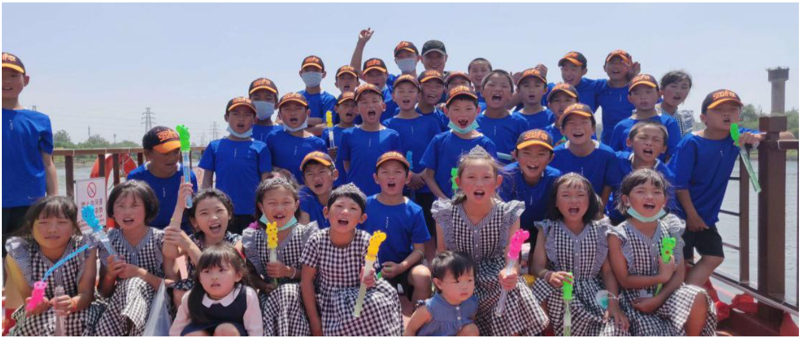

# 强棒天使计划

## 强棒天使计划概况

强棒基地由前国家棒球队队长孙岭峰与爱心人士联合筹资建设，创建中国第一支公益棒球队。基地主要资助对象为全国范围内 7-10 岁困境儿童，通过专业的棒球技能获得职业发展方向和未来的就业机会。截止到 2020 年11月，项目共资助困境儿童80名，其中女孩 26名，多数儿童来自四川大凉山彝族自治州。通过基地的学习训练，她们重拾了信心也对未来建立目标，部分孩子通过努力训练走向了更大的舞台，获得了更多人的关注和认可。

2019年12月，第一批女孩入驻强棒天使基地，至今已有26名女孩，最小的6岁，最大14岁。25个来自四川大凉山的彝族姑娘。她们分别组成了U10和U12年龄组，是中国第一支女子棒球队。

“强棒天使项目”紧跟国家“精准扶贫”的公益战略方针， 针对 7-9 岁贫困儿童进行全面帮扶。经过多年的专业和系统的 棒球训练，完成对孩子未来的职业规划，一方面消除了社会的安 全隐患，让这些儿童能够有一技之长，得到全面的素质培养，另 一方面为中国棒球产业的发展储备并输送大量的人才。

习近平主席曾经说过:抓好教育是扶贫开发的根本大计，要 让贫困家庭的孩子都能接受公平的、有质量的教育，起码学会一 项有用的技能，不要让孩子输在起跑线上，尽力阻断贫困代际传 递。把贫困地区孩子培养出来，这才是根本的扶贫之策。

“授人以鱼不如授人以渔”，强棒天使项目通过长期投入的 方式，培养孩子棒球职业能力，在解决基本生活的同时，塑造他 们健全、独立的品格，帮助他们实现更高层次的人生目标。

## 强棒天使队

“强棒天使队”，是中国第一支由困境儿童组成的公益 棒球队，中国第一支由多民族儿童组成的棒球队，中国第一支代 表亚太地区征战世界的少年棒球队。在国内外多项棒球赛事中披 金斩银，成为了国内球队同年龄段当仁不让的第一，形成了难以 置信的影响力。不仅中国的球队以能跟天使队打场比赛为荣，韩 国、日本、美国的一些世界级的联赛争相邀请强棒天使队，作为 中国最高水平的队伍参赛。“强棒天使队”经常被邀请参加国内 省市间的友谊邀请赛，同时作为北京唯一一支职业棒球队—北京 猛虎队的后备力量培养。

2017 年 7 月“强棒天使队”有 4 名孩子入选国家少年棒球 队，奔赴日本代表中国参加著名国际青少年棒球赛事 PONY 杯， 并荣获成长组冠军。

2018 年 8 月，“强棒天使队”受到了来自 PONY 少棒联盟 美国组委会的官方关注，作为亚太区的唯一一支代表队，球队受 邀参加 2018 年 PONY 世界大赛 U11 Bronco 组决赛阶段的角逐， 这是中国棒球历史上首次直接获邀代表亚太区参加国际青少年棒 球赛事，刷新了中国体育的历史。赛事期间，球队在当地形成轰动性的影响，孩子们健康、阳光、坚强的动人事迹登上著名报纸 《波士顿环球报》、《世界日报》、《侨报》等美国媒体。
