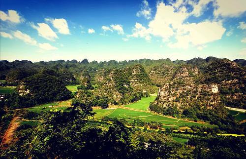

凉山是我出生的地方，下面我来带大家一起了解一下这个美丽的地方。

凉山彝族自治州，首府驻西昌市，是四川省的21个地级行政区之一。位于四川省西南部，北起大渡河与雅安市、甘孜州接壤，南至金沙江与云南省相望，东临云南省昭通市和四川省宜宾市、乐山市，西连甘孜州；地势西北高，东南低，北部高，南部低；气候属于亚热带季风气候区。全市6.04万平方公里，下辖2个县级市，14个县，1个自治县；2018年末户籍人口529.94万人。

凉山自古就是通往云南和东南亚的重要通道、“南方丝绸之路”的重镇；地处“大香格里拉旅游环线”腹心地带，有A级景区27个，其中4A级景区9个，有邛海—泸山、邛海国家湿地公园、螺髻山、泸沽湖、西昌卫星发射中心等景点；有全世界唯一反映奴隶社会形态的博物馆—凉山奴隶社会博物馆，有彝族漆器传统技艺等18项国家级非物质文化遗产，“彝族火把节”是国务院向联合国教科文组织推荐申报的“人类非物质文化遗产”，泸沽湖摩梭文化有“人类母系社会活化石”之称。 2020年9月22日，荣获2019年度四川省粮食生产“丰收杯”。

## 气候

凉山彝族自治州区域的气候属于亚热带季风气候区，干湿分明，冬半年日照充足，少雨干暖；夏半年云雨较多，气候凉爽。除尼日河四季较分明外，其它地方以平均气温划分季节，四季不明显，海拔较高地区无夏，南部海拔较低地区无冬。四季虽不明显，但干湿季节却显著。大致是11～4月为干季，5～10月为湿季。干湿季特征显著不同。干季气候特点是降水稀少，温差不大，阳光充足，气候暖和。湿季气候特点是温凉湿润、多阴雨。湿季的明显特征是多雨，故习惯上称湿季为雨季。凉山州以安宁河谷为中轴，由中南向西北和东北逐渐升高的山地及众多高大山体，造就区域地域上和整体地域上完整的垂直气候带谱，层次分明，有规律地再现水平方向上各种气候带的更替形式。气温、降水等气候要素随海拔高度增加而规律性地变化，变化幅度明显较水平方向大。平均而言，气温水平方向上的变化每百公里不超过4℃，气温垂直方向上的变化每千米超过6℃。凉山地形的复杂及大气环流的复杂多样性，使凉山干雨明显、立体气候特征发生变异，程度不同地改变凉山气候的基本格局，导致凉山气候的复杂性、多样性。在凉山东西宽360公里，南北长370公里的不太大范围内，气候既有南北东西差异，还有垂直差异、季节差异，呈现“一山有四季，十里不同天”的复杂多样气候景象。

## 风景名胜

截至2018年6月，凉山彝族自治州有A级景区27个，其中4A级景区9个，有邛海-泸山、螺髻山、泸沽湖、西昌卫星发射中心等。泸山主峰海拔2317米。邛海最大水域面积31平方公里，流域集水面积为309平方公里，容积为3.2亿立方米，较大的河流有小清河、官坝河和鹅掌河，其中官坝河集水面积较大，能维持终年有水。邛海湿地总面积2万亩，是中国最大的城市生态保护湿地。邛海旅游度假期是首批17个国家级旅游度假区之一。螺髻山是第四纪古冰川天然博物馆，主峰海拔4359米。泸沽湖位于全州盐源县和云南宁蒗县交界处，水域面积58.8平方公里，平均水深40余米，2/3的水域面积位于全州，库容9.5亿立方米。西昌卫星发射中心，是中国4个航天发射场之一（酒泉、太原、西昌、文昌），文昌发射场也属于西昌卫星发射中心，文昌发射场因为纬度更低，具有海运的优势，主要承担大功率火箭的发射任务。

### 邛都古城

古人曾用“松风水月”来描绘古城西昌的风光，即泸山的松、安宁河的风、邛海的水、西昌的月。

### 泸山风景

泸山又名蛙山，在西昌城南5公里的邛海南岸，是四川省级风景名胜区之一泸山海拨2317米。它东临碧波如镜的邛海，西濒蜿蜒秀丽的安宁河，北有历史古城西昌，南依巍巍耸立的螺髻山。

## 地方文化

凉山彝族千百年来在这片富有古老文化、神奇传说、迷人的自然景观的土地上，繁衍生息，传承和保留着中国彝族古朴、浓郁、独特的文化传统，创造了具有凉山自然封闭形态的包括天文、星相、历法在内的独特而优秀的民族文化。

#### References
* 四川凉山：https://baike.baidu.com/pic/%E5%87%89%E5%B1%B1%E5%BD%9D%E6%97%8F%E8%87%AA%E6%B2%BB%E5%B7%9E/2721144/0/d52a2834349b033bb6ea94721ece36d3d539bd3c?fr=lemma&ct=single#aid=0&pic=d52a2834349b033bb6ea94721ece36d3d539bd3c 
