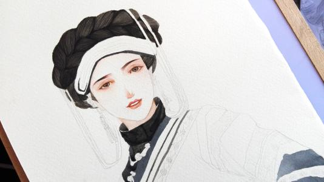

> 五十六个民族，五十六朵花
> 五十六个兄弟姐妹是一家～

相信大家从这首歌里已经听出来了：没错，我是一个来自少数民族彝族的小姑娘！

“彝”这个字有一点点难写，但是彝族可是我国第六大少数民族哟！

## 至于我们名字的由来吗：

新中国成立前，由于地区和方言不同，彝族支系繁多，有许多不同的他称和自称，主要的他称有“夷”、“黑彝”、“白彝”、“红彝”、“甘彝”、“花腰”、“密岔”等。

主要的自称中，云南昭通、武定、禄劝、弥勒、石屏，四川大、小凉山的彝族自称“诺苏”、“纳苏”、“聂苏”，这部分彝族约占总人口的1/2。云南哀牢山、无量山及开远、文山、马关一带的彝族自称“密撒（泼）”、“腊苏（泼）”、“濮拉泼”、“尼濮”等。贵州的彝族自称“糯苏”、“纳”、“诺”、“聂”等。

新中国成立后，经过民族识别，按照广大彝族人民的共同意愿，以鼎彝之“彝”作为统一的民族名称。

## 彝族文化

要说我们文化中我最喜欢的一个部分，那就要数我们的传统服饰了！

彝族支系繁多，居住分散，自然环境复杂，社会经济发展不平衡，其服饰在质地、款式、纹式等方面形成了明显的地域特征。大体可根据凉山、乌蒙山、红河、滇东南、滇西、楚雄六个彝族聚居区分为六大类型。

### 凉山

我们大凉山的彝族传统服饰，男女皆穿右衽大襟衣，披擦尔瓦、披毡、裹绑腿，平时跣足，冬天穿麻鞋。

男子头缠中髻，不同次方言区的样式不同，左耳戴蜜腊珠、银耳环等饰物。男裤在北部方言区根据不同的次方言有“大裤脚”、“中裤脚”、“小裤脚”之别。

妇女着百褶裙、戴头帕，生育后，可戴帽或缠帕，喜佩耳饰、手饰，戴银领牌。传统衣料以自织自染的毛麻织品为主，传统色彩为黑、红、黄三色。图案纹饰多为鸡冠、羊角、火镰、蕨草、窗格等动植物和生活物品。

### 乌蒙山

相信大家都听过毛主席著名诗词中的乌蒙山吧！

乌蒙山彝族服饰男女均为青、蓝色大襟右衽长衫或短衫，长裤，缠黑色或白色头帕，系白色腰带，着绣花高钉“鹞子鞋”或“鹰头鞋”。

男子服饰无花纹，披羊毛披毡，女子服饰领口、袖口、襟边、下摆均饰彩色花纹组合图案。

### 红河

红河地区彝族男子服饰多为对襟、短衣、长裤。妇女服饰款式多，既有长衫，也有中长衫和短装，大多外套坎肩，系围裙，头饰琳琅满目，尤喜以银泡、绒线做花为饰。图案以自然纹为多，几何纹次之。

关于彝族，我还有很多很多想说的！欢迎大家来到我的家乡，亲身感受我们彝族丰富的文化氛围和热情的人情风貌！

#### References
* 彝族：https://baike.baidu.com/item/%E5%BD%9D%E6%97%8F
